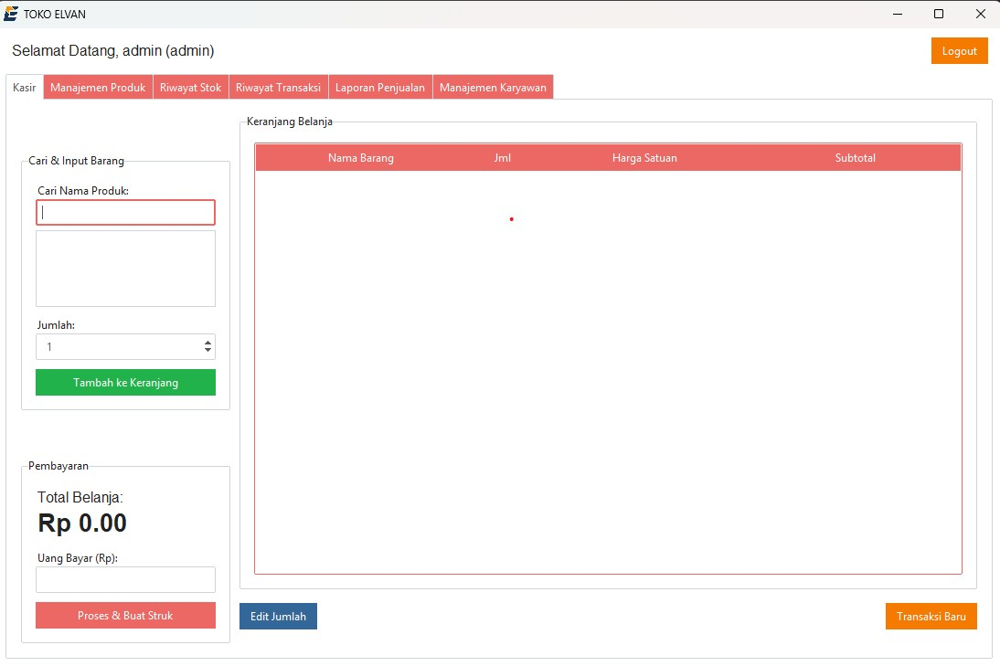

# Aplikasi Kasir Desktop - Toko Elvan

<p align="center">
  
</p>

Aplikasi Point of Sale (POS) atau kasir desktop yang dibuat menggunakan Python dan Tkinter dengan tema modern dari `ttkbootstrap`. Aplikasi ini dirancang untuk mengelola transaksi, produk, dan laporan penjualan untuk toko atau warung di Jatiwangi, West Java, Indonesia.

## Tampilan Utama

<p align="center">
  
</p>

## Fitur Utama

- **Sistem Login**: Hak akses terpisah untuk `admin` dan `kasir`.
- **Splash Screen**: Menampilkan logo toko saat aplikasi pertama kali dijalankan.
- **Antarmuka Kasir Modern**: Dilengkapi dengan *search bar* untuk pencarian produk yang cepat.
- **Manajemen Produk**: Fitur lengkap (Tambah, Edit, Hapus) untuk produk beserta stoknya.
- **Manajemen Pengguna**: Admin dapat menambah dan menghapus akun kasir.
- **Riwayat Lengkap**:
    - **Riwayat Transaksi**: Melihat kembali semua transaksi yang pernah terjadi beserta detailnya.
    - **Riwayat Stok**: Melacak setiap pergerakan stok (masuk karena penambahan, keluar karena penjualan, atau koreksi).
- **Laporan Penjualan**:
    - Filter laporan berdasarkan harian dan bulanan.
    - **Download Laporan ke Excel** untuk analisis lebih lanjut.
- **Cetak Struk ke PDF**:
    - Membuat struk dalam format PDF secara otomatis setelah transaksi.
    - Menyimpan struk di folder `Documents/Struk Warung` pengguna.

## Teknologi yang Digunakan

- **Bahasa**: Python 3
- **Antarmuka (GUI)**: Tkinter & `ttkbootstrap`
- **Database**: SQLite3
- **Pembuatan PDF**: `reportlab`
- **Export Excel**: `openpyxl`
- **Gambar & Ikon**: `Pillow`
- **Interaksi OS (Cetak)**: `pywin32` (untuk Windows)

## Instalasi & Menjalankan Proyek

Untuk menjalankan proyek ini di komputer Anda, ikuti langkah-langkah berikut:

1.  **Clone Repositori**
    Pastikan Anda memiliki koneksi internet yang stabil.
    
    ````bash
    git clone https://github.com/billyaf/kasirApp
    cd kasirApp
    ````

2.  **Buat Virtual Environment (Disarankan)**
    ````bash
    python -m venv venv
    venv\Scripts\activate  # Untuk Windows
    ````

3.  **Instal Dependensi**
    ````bash
    pip install ttkbootstrap pillow reportlab openpyxl pywin32
    ````

4.  **Inisialisasi Database**
    Jalankan ini sekali untuk membuat `warung.db` dan akun admin default:
    ````bash
    python database.py
    ````
    - **Username**: `admin`
    - **Password**: `admin`

5.  **Jalankan Aplikasi**
    ````bash
    python main.py
    ````

## Mengemas Aplikasi menjadi `.exe`

Untuk membuat file `.exe` untuk Windows, pastikan semua aset (`logo.png`, `logo_only.png`, `logo.ico`) ada di direktori proyek.

````bash
pyinstaller --onefile --windowed --add-data "logo.png;." --add-data "logo_only.png;." --icon="logo.ico" --name "KasirTokoElvan" main.py
